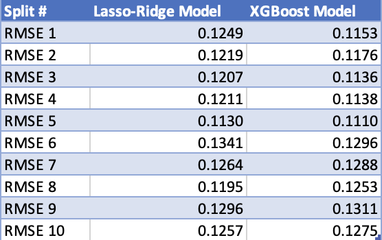

```{r setup, include=FALSE}
knitr::opts_chunk$set(echo = TRUE)
```

## Technical Details

### Background

For this project, we were looking to develop two different models to be able to predict the sale price of a home present in the [Ames Housing Data Set](http://jse.amstat.org/v19n3/decock.pdf). One model was going to be based on a linear regression model while the other was to be based on a tree model. The accuracy of the models would be evaluated on 10 training/test splits. With the model being trained on a training split to then be used to predict the sale price on unseen data in the test split. Benchmarks for RMSE values were provided to help indicate if the models' predictions were accurate enough. 

Before these models were created however, data integrity checks as well as various other pre-processing methods were leveraged to ensure the models could be as accurate as possible. 

The technical details are described in more detail below.

### Pre-Processing 

As mentioned in the project details, the training and test data needed to be pre-processed separately, which we did. However, the same pre-processing approach was used for both the training and test data. An extra step was applied to the test data though which was to ensure it had the same levels as the train data. With that, following the pre-processing of both the training and test data, we removed any levels from the test data that were not present in the training data and added in 0-value levels to the test data for the levels present in train but not test. 

Additionally, it's quite possible that one could perform different pre-processing between the two types of models, Linear Regression and Tree-based, however we decided to use the same pre-processing approach prior to developing and training both types of models.

#### Missing Data

When evaluating our data inputs, both the training and test data, we wanted to make sure we accounted for any missing data. In this data set, it appeared there were only 159 missing values with each of those being for the `Garage_Yr_Blt` variable. For each of these 159 instances, we filled in the null value with 0 so the models would not be impacted by the missing data. 


#### Variable Removal

With guidance from a [Campuswire Post](https://campuswire.com/c/G497EEF81/feed/420), some imbalanced categorical variables were removed as well as `Longitude` and `Latitude` since there were already other neighborhood characteristics included that were easier to understand.

Additionally, `PID` and `Sale_Price` were also excluded so they wouldn't be included in the training of the model or in the prediction. The log of `Sale_Price` was saved off in a vector to be used as a training label later on though. 

The above removals were applied to both the training and test data sets, with the exception of the `Sale_Price` removal as that was already taken care of for the test data set before reading it in.  

#### Winsorization 

With additional guidance from the same [Campuswire Post](https://campuswire.com/c/G497EEF81/feed/420) from above, we applied Winsorization to try and minimize the impact outliers might have on our models. The upper 95% quantile value for the variables were used as the threshold when performing this Winsorization.

#### Dummy Variables for Categorical Variables

For all the categorical variables, binary dummy variables needed to be created to be properly handled by our models. This was done the same for both the training and test data.

#### Pre-processing Summary

After all this pre-processing, we ended up with 304 predictor variables that were evaluated by both the linear regression model as well as the tree-based model. 

### Model Implementation

The below sections outlines the two models we implemented and their approach:

#### Model 1 Implementation (Ridge Regression Model with Lasso Variable Selection)

Based on guidance from a [Campuswire Post](https://campuswire.com/c/G497EEF81/feed/420) from the professor, we elected to use a mix of Lasso and Ridge for our model implementation. We first used Lasso to select the variables while using the `lambda.min` value. We then used those selected variables in a Ridge model. With that approach, we saw our RMSE value fall below the respective benchmark values on all 10 splits. 

#### Model 2 Implementation (XGBoost Model)

Based on more guidance from a [Campuswire Post](https://campuswire.com/c/G497EEF81/feed/397) from the professor, we elected to use XGBoost for our tree based model. The below parameters were applied from the post and were validated as ones that produced an accurate enough model. 

- max_depth: the default of 6 was used here which signifies how "deep" the decision tree can go
- eta: 0.05 was used here which puts it more on the robust side when avoiding overfitting.
- nrounds: 1000 was used here to signify how many decision trees would be in the final model
- subsample: 0.50 was used here which indicates that half of the data was randomly collected to have a tree which should prevent overfitting
- verbose: set to `FALSE` to avoid an overwhelming amount of messages being printed to the console

### Results

#### Model Accuracy

For each split of each model, RMSE was calculated on the models' predictions compared to the actual values. For the first 5 splits, the RMSE value needed to be below 0.125 and for the last 5 splits, the RMSE value needed to be below 0.135.

As seen with the table below, our models were able to be below those benchmarks for all splits. 





#### Model Timing

For this project, we wanted to capture how long it took for our models to be trained and then to make its predictions. Those details are outlined below for each model as well as in summary.

- Lasso-Ridge Model
  - Model Training: 22.8 seconds
  - Model Predictions: 0.1 seconds
  - Total Model Time: 22.9 seconds

- XGBoost Model
  - Model Training: 1027.5 seconds
  - Model Predictions: 1.2 seconds
  - Total Model Time: 1028.7 seconds (17.1 minutes)
  
- Total Time (across both models): 17.5 minutes


